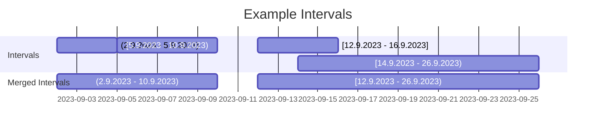
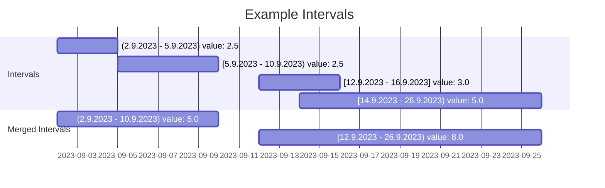

# EasyIntervals

A .NET package intended to efficiently simplify the work with sets of generic intervals, especially in use cases requiring often mutation (add, remove). This is done with **IntervalSet** collection. It provides main operations like **Add**, **Remove**, **Union**, **Intersect**, **Except**, **Merge**.

## Get Started

EasyIntervals can be installed using the Nuget package manager or the `dotnet` CLI.

```Shell
dotnet add package EasyIntervals
```

## Usage

- [Interval Basics](#interval-basics)
- [IntervalSet](#intervalset)
- [Add/Remove](#addremove)
- [Union](#union)
- [UnionWith](#unionwith)
- [Intersection](#intersection)
- [Covering Intersection](#covering-intersection)
- [Within Intersection](#within-intersection)
- [Exception](#exception)
- [Covering Exception](#covering-exception)
- [Within Exception](#within-exception)
- [Merge](#merge)

### Interval Basics

An Interval can be created with start, end and optional value input parameters. By default type of interval is **Open**. Interval type can be **Closed**, **StartClosed**, **EndClosed** and **Open**.

```CSharp
var interval1 = new Interval<int, decimal?>(10, 50); // open (10, 50) - excludes both limits
var interval2 = new Interval<int, decimal?>(10, 50, IntervalType.Closed); // closed [10, 50] - includes both limits
var interval3 = new Interval<int, decimal?>(10, 50, IntervalType.StartClosed); // start closed [10, 50) - includes start only
var interval4 = new Interval<int, decimal?>(10, 50, IntervalType.EndClosed); // end closed (10, 50] - includes end only
var interval5 = new Interval<int, decimal?>(10, 50, 2.5m, IntervalType.Closed); // closed [10, 50], value: 2.5
```

Interval can also be created from value tuple:

```CSharp
Interval<double, decimal?> interval1 = (0.1d, 0.5d); // open (0.1, 0.5)
Interval<double, decimal?> interval2 = (0.1d, 0.5d, IntervalType.Closed); // closed [0.1, 0.5]
Interval<double, decimal?> interval3 = (0.1d, 0.5d, 2.5m, IntervalType.Closed); // closed [0.1, 0.5], value: 2.5
```

When no value is passed to create an Interval, a default value is assigned:

```CSharp
// passing value
Interval<double, decimal?> interval1 = (0.1d, 0.5d, 2.5m); // open (0.1, 0.5), value: 2.5

// not passing value
Interval<double, decimal?> interval2 = (0.1d, 0.5d); // open (0.1, 0.5), value: null
Interval<double, decimal> interval3 = (0.1d, 0.5d); // open (0.1, 0.5), value: 0.0
```

Operations over specific intervals is done through the functions of **IntervalTools** class.

Here is an example how to check if 2 intervals intersect:

```CSharp
var result1 = IntervalTools.HasAnyIntersection<int, decimal?>((10, 20), (18, 30));
Console.WriteLine(result1);
// True

var result2 = IntervalTools.HasAnyIntersection<int, decimal?>((10, 20), (22, 30));
Console.WriteLine(result2);
// False
```

Here is an example how to check if an interval covers another interval:

```CSharp
var result1 = IntervalTools.Covers<int, decimal?>(interval: (10, 20), other: (12, 18));
Console.WriteLine(result1);
// True

var result2 = IntervalTools.Covers<int, decimal?>(interval: (10, 20), other: (10, 30));
Console.WriteLine(result2);
// False
```

### IntervalSet

Manipulation over sets of intervals is done with **IntervalSet** collection. It's an implementation of [Augmented Interval Tree](https://en.wikipedia.org/wiki/Interval_tree#Augmented_tree) abstract data structure, using self-balancing Binary Search Tree (BST) - [AA Tree](https://en.wikipedia.org/wiki/AA_tree). **IntervalSet** provides basic operations - **Add**, **Remove**, **Union**, **UnionWith**, **Intersect**, **Except**, **Merge**. It's initialization and union algorithms are influenced by [Sorted Set](https://github.com/dotnet/runtime/blob/main/src/libraries/System.Collections/src/System/Collections/Generic/SortedSet.cs) from System.Collections.Generic.

### Add/Remove

Adding an interval. It returns `true` if it's added. When interval with same limits and type exists, it's not added.

```CSharp
var intervalSet = new IntervalSet<int, decimal?>();

Console.WriteLine(intervalSet.Add((5, 10, 20.5m))); // True
Console.WriteLine($"[{string.Join(", ", intervalSet)}]"); // [(5, 10): 20.5]
Console.WriteLine(intervalSet.Add((5, 10, 25.5m))); // False
Console.WriteLine($"[{string.Join(", ", intervalSet)}]"); // [(5, 10): 20.5]
```

Removing interval. It returns `true` if it's removed. When interval with same limits, type and value exists, it's being removed.

```CSharp
var intervalSet = new IntervalSet<int, decimal?>()
{
    (5, 10, 20.5m)
};

Console.WriteLine(intervalSet.Remove((5, 10, 25.5m))); // False
Console.WriteLine($"[{string.Join(", ", intervalSet)}]"); // [(5, 10): 20.5]
Console.WriteLine(intervalSet.Remove((5, 10, 20.5m))); // True
Console.WriteLine($"[{string.Join(", ", intervalSet)}]"); // []
```

### Union

Unions all unique intervals from the current and input interval set. If there are intervals with same limits and type but different values, only the first occurence will be added:

```CSharp
var intervalSet1 = new IntervalSet<int, decimal?>
{
    (2, 5), // (2, 5)
    (3, 8, IntervalType.Open), // (3, 8)
    (7, 10, 2.5m), // (7, 10): 2.5
};

var intervalSet2 = new IntervalSet<int, decimal?>
{
    (3, 8, IntervalType.Closed), // [3, 8]
    (7, 10, 3m), // (7, 10): 3.0
    (11, 16, 15.0m, IntervalType.StartClosed), // [11, 16): 15.0
    (11, 16, 10.0m, IntervalType.StartClosed), // [11, 16): 10.0
    (11, 14, IntervalType.EndClosed), // (11, 14]
};

var unionIntervalSet = intervalSet1.Union(intervalSet2);
Console.WriteLine($"[{string.Join(", ", unionIntervalSet)}]");
// [(2, 5), [3, 8], (3, 8), (7, 10): 2.5, [11, 16): 15.0, (11, 14]]
```

### UnionWith

Adds all unique intervals from given input enumeration of intervals. If there are intervals matching by limits and type but different values, only the existing occurence will remain:

```CSharp
var intervalSet = new IntervalSet<int, decimal?>
{
    (2, 5), // (2, 5)
    (3, 8, IntervalType.Open), // (3, 8)
    (7, 10, 2.5m), // (7, 10): 2.5
};

var inputIntervals = new List<Interval<int, decimal?>>
{
    (3, 8, IntervalType.Closed), // [3, 8]
    (7, 10, 3m), // (7, 10): 3
    (11, 16, 15.0m, IntervalType.StartClosed), // [11, 16): 15.0
    (11, 16, 10.0m, IntervalType.StartClosed), // [11, 16): 10.0
    (11, 14, IntervalType.EndClosed), // (11, 14]
};

intervalSet.UnionWith(inputIntervals);
Console.WriteLine($"[{string.Join(", ", intervalSet)}]");
// [(2, 5), [3, 8], (3, 8), (7, 10): 2.5, [11, 16): 15.0, (11, 14]]
```

### Intersection

```mermaid
gantt
    title Example Intervals
    dateFormat  X
    axisFormat %s

    section Intersection Interval
    [8, 11]   :active, 8, 11

    section Intervals
    (3, 8)   : 3, 8
    [3, 8]   :crit, active, 3, 8
    (2, 5)   :after, 2, 5
    (7, 10)    :crit, active, 7, 10
    (11, 14]    : 11, 14
    [11, 16)    :crit, active, 11, 16
```



Code:

```CSharp
var intervalSet = new IntervalSet<int, decimal?>
{
    (2, 5), // (2, 5)
    (3, 8, IntervalType.Open), // (3, 8)
    (3, 8, IntervalType.Closed), // [3, 8]
    (7, 10), // (7, 10)
    (11, 16, IntervalType.StartClosed), // [11, 16)
    (11, 14, IntervalType.EndClosed), // (11, 14]
};

var intersectionInterval = new Interval<int, decimal?>(8, 11, IntervalType.Closed);
var intersectedIntervals = intervalSet
    .Intersect(intersectionInterval); // [8, 11]
Console.WriteLine($"[{string.Join(", ", intersectedIntervals)}]");
// [[3, 8], (7, 10), [11, 16)]
```

You can also specify the type of intersection between the given interval and the interval set. By default the intersection type is **Any**, searching for any kind of intersection between the intervals:

```CSharp
var intersectedIntervals = intervalSet
    .Intersect(intersectionInterval, IntersectionType.Any);
Console.WriteLine($"[{string.Join(", ", intersectedIntervals)}]");
// [[3, 8], (7, 10), [11, 16)]
```

There are 2 more type of intersection - **Cover** where the given interval covers intervals and **Within** where the given one is within intervals.

### Covering Intersection

Intersection of interval set with an input interval that covers intersected intervals:

```mermaid
gantt
    title Example Intervals
    dateFormat  X
    axisFormat %s

    section Intersection Interval
    [5, 11]   :active, 5, 11

    section Intervals
    (2, 5)   : 2, 5
    [5, 10)   :crit, active, 5, 10
    [3, 12]   : 3, 12
    [11, 16)    : 11, 16
```



Code:

```CSharp
var intervalSet = new IntervalSet<int, decimal?>
{
    (2, 5), // (2, 5)
    (3, 12, IntervalType.Closed), // [3, 12]
    (5, 10, IntervalType.StartClosed), // [5, 10)
    (11, 16, IntervalType.StartClosed), // [11, 16)
};

var intersectionInterval = new Interval<int, decimal?>(5, 11, IntervalType.Closed);
var coveredIntervals = intervalSet
    .Intersect(intersectionInterval, IntersectionType.Cover);
Console.WriteLine(
    $"{intersectionInterval} covers [{string.Join(", ", coveredIntervals)}]");
// [5, 11] covers [[5, 10)]
```

### Within Intersection

Intersection of interval set with an input interval that is within intersected intervals:

```mermaid
gantt
    title Example Intervals
    dateFormat  X
    axisFormat %s

    section Intersection Interval
    [5, 11]   :active, 5, 11

    section Intervals
    (2, 5)   : 2, 5
    [5, 10)   : 5, 10
    [3, 12]   :crit, active, 3, 12
    [11, 16)    : 11, 16
```



Code:

```CSharp
var intervalSet = new IntervalSet<int, decimal?>
{
    (2, 5), // (2, 5)
    (3, 12, IntervalType.Closed), // [3, 12]
    (5, 10, IntervalType.StartClosed), // [5, 10)
    (11, 16, IntervalType.StartClosed), // [11, 16)
};

var intersectionInterval = new Interval<int, decimal?>(5, 11, IntervalType.Closed);
var coveringIntervals = intervalSet
    .Intersect(intersectionInterval, IntersectionType.Within);
Console.WriteLine(
    $"{intersectionInterval} is within [{string.Join(", ", coveringIntervals)}]");
// [5, 11] is within [[3, 12]]
```

### Exception

Calling **Except** over the IntervalSet returns the not intersected (excepted) intervals:

```mermaid
gantt
    title Example Intervals
    dateFormat  X
    axisFormat %s

    section Intersection Interval
    [8, 11]   :active, 8, 11

    section Intervals
    (3, 8)   :crit, active, 3, 8
    [3, 8]   : 3, 8
    (2, 5)   :crit, active, 2, 5
    (7, 10)    : 7, 10
    (11, 14]    :crit, active, 11, 14
    [11, 16)    : 11, 16
```



Code:

```CSharp
var intervalSet = new IntervalSet<int, decimal?>
{
    (2, 5), // (2, 5)
    (3, 8, IntervalType.Open), // (3, 8)
    (3, 8, IntervalType.Closed), // [3, 8]
    (7, 10), // (7, 10)
    (11, 16, IntervalType.StartClosed), // [11, 16)
    (11, 14, IntervalType.EndClosed), // (11, 14]
};

var intersectionInterval = (8, 11, IntervalType.Closed);
var exceptedIntervals = intervalSet
    .Except(intersectionInterval);
Console.WriteLine($"[{string.Join(", ", exceptedIntervals)}]");
// [(2, 5), (3, 8), (11, 14]]
```

### Covering Exception

Exception of interval set with an input interval that doesn't cover excepted intervals:

```mermaid
gantt
    title Example Intervals
    dateFormat  X
    axisFormat %s

    section Exception Interval
    [5, 11]   :active, 5, 11

    section Intervals
    (2, 5)   :crit, active, 2, 5
    [5, 10)   : 5, 10
    [3, 12]   :crit, active, 3, 12
    [11, 16)    :crit, active, 11, 16
```



Code:

```CSharp
var intervalSet = new IntervalSet<int, decimal?>
{
    (2, 5), // (2, 5)
    (3, 12, IntervalType.Closed), // [3, 8]
    (5, 10, IntervalType.StartClosed), // [5, 10)
    (11, 16, IntervalType.StartClosed), // [11, 16)
};

var coveringInterval = new Interval<int, decimal?>(5, 11, IntervalType.Closed);
var notCoveredIntervals = intervalSet
    .Except(coveringInterval, IntersectionType.Cover);
Console.WriteLine(
    $"{coveringInterval} doesn't cover [{string.Join(", ", notCoveredIntervals)}]");
// [5, 11] doesn't cover [(2, 5), [3, 12], [11, 16)]
```

### Within Exception

Exception of interval set with an input interval that is not within excepted intervals:

```mermaid
gantt
    title Example Intervals
    dateFormat  X
    axisFormat %s

    section Exception Interval
    [5, 11]   :active, 5, 11

    section Intervals
    (2, 5)   :crit, active, 2, 5
    [5, 10)   :crit, active, 5, 10
    [3, 12]   : 3, 12
    [11, 16)    :crit, active, 11, 16
```



Code:

```CSharp
var intervalSet = new IntervalSet<int, decimal?>
{
    (2, 5), // (2, 5)
    (3, 12, IntervalType.Closed), // [3, 8]
    (5, 10, IntervalType.StartClosed), // [5, 10)
    (11, 16, IntervalType.StartClosed), // [11, 16)
};

var withinInterval = new Interval<int, decimal?>(5, 11, IntervalType.Closed);
var notCoveringIntervals = intervalSet
    .Except(withinInterval, IntersectionType.Within);
Console.WriteLine(
    $"{withinInterval} is not within [{string.Join(", ", notCoveringIntervals)}]");
// [5, 11] is not within [(2, 5), [5, 10), [11, 16)]
```

### Merge

You can also merge intervals. Calling **Merge** returns IntervalSet with the merged intervals. If no merge function given, default value is assigned to the new merged intervals:



Code:

```CSharp
---
displayMode: compact
---
var intervalSet = new IntervalSet<DateOnly, decimal?>
{
    (new DateOnly(2023, 09, 2), new DateOnly(2023, 09, 5)), // (2 - 5)
    (new DateOnly(2023, 09, 5), new DateOnly(2023, 09, 10), IntervalType.StartClosed), // [5 - 10)
    (new DateOnly(2023, 09, 12), new DateOnly(2023, 09, 16), IntervalType.Closed), // [12 - 16]
    (new DateOnly(2023, 09, 14), new DateOnly(2023, 09, 26), IntervalType.StartClosed) // [14 - 26)
};

var mergedIntervalSet = intervalSet.Merge();
Console.WriteLine($"[{string.Join(", ", mergedIntervalSet)}]");
// [(9/2/2023, 9/10/2023), [9/12/2023, 9/26/2023)]
```

Here is an example passing a merge function:



Code:

```CSharp
var intervalSet = new IntervalSet<DateOnly, decimal?>
{
    (new DateOnly(2023, 09, 2), new DateOnly(2023, 09, 5), 2.5m), // (2 - 5)
    (new DateOnly(2023, 09, 5), new DateOnly(2023, 09, 10), 2.5m, IntervalType.StartClosed), // [5 - 10)
    (new DateOnly(2023, 09, 12), new DateOnly(2023, 09, 16), 3.0m, IntervalType.Closed), // [12 - 16]
    (new DateOnly(2023, 09, 14), new DateOnly(2023, 09, 26), 5.0m, IntervalType.StartClosed) // [14 - 26)
};

var mergedIntervalSet = intervalSet.Merge((itv1, itv2) => itv1.Value + itv2.Value);
Console.WriteLine($"[{string.Join(", ", mergedIntervalSet)}]");
// [(9/2/2023, 9/10/2023): 5.0, [9/12/2023, 9/26/2023): 8.0]
```
