```mermaid
gantt
    title Example Intervals
    dateFormat  X
    axisFormat %s

    section Intersection Interval
    [8, 11]   :active, 8, 11

    section Intervals
    (3, 8)   : 3, 8
    [3, 8]   :crit, active, 3, 8
    (2, 5)   :after, 2, 5
    (7, 10)    :crit, active, 7, 10
    (11, 14]    : 11, 14
    [11, 16)    :crit, active, 11, 16
```

# Intervals.Tools

This .NET package provides basic set of tools for working with generic intervals.

`// TODO: Enhance with Invert(); Slice(itv); Union(itv[]); HasIntersection(itv/limit)`

## About

> [!NOTE]
> This package is intended to simplify the work with large set of intervals in use cases requiring often mutation (add, remove, update).

There aren't many packages available on [NuGet](https://www.nuget.org/), providing these functionalities with flexible and friendly enough programming API. The goal of this package is to provide useful and rich library for convenient work with intervals.

## Usage

### IntervalSet

**IntervalSet** is a collection for storing large amount of unique intervals where multiple add, remove and search operations can be done in efficient time. It's inspired by [IntervalTree](https://github.com/mbuchetics/RangeTree) and has similarities with [System.Collections.Generic.SortedSet\<T\>](https://learn.microsoft.com/en-us/dotnet/api/system.collections.generic.sortedset-1).

Here is an example for intersection over IntervalSet:



Code:

```CSharp
var intervalSet = new IntervalSet<int>
{
    (2, 5), // (2, 5) - if interval type is not specified, interval is open by default
    (3, 8, IntervalType.Open), // (3, 8)
    (3, 8, IntervalType.Closed), // [3, 8]
    (7, 10), // (7, 10)
    (11, 16, IntervalType.StartClosed), // [11, 16)
    (11, 14, IntervalType.EndClosed), // (11, 14]
};

var intersectionInterval = (8, 11, IntervalType.Closed);
var intersectedIntervals = intervalSet
    .Intersect(intersectionInterval); // [8, 11]
Console.WriteLine($"[{string.Join(", ", intersectedIntervals)}]");
// [[3, 8], (7, 10), [11, 16)]
```

Calling Except over the IntervalSet returns the not intersected (excepted) intervals:

```CSharp
var exceptedIntervals = intervalSet
    .Except((8, 11, IntervalType.Closed)); // [8, 11]
Console.WriteLine($"[{string.Join(", ", exceptedIntervals)}]");
// [(2, 5), (3, 8), (11, 14]]
```

You can also specify the type of intersection between the given interval and the interval set. By default the intersection type is **Any**, searching for any kind of intersection between the intervals:

```mermaid
gantt
    title Example Intervals
    dateFormat  X
    axisFormat %s

    section Intersection Interval
    [5, 11]   :active, 5, 11

    section Intervals
    (2, 5)   : 2, 5
    [5, 10)   :crit, active, 5, 10
    [3, 12]   :crit, active, 3, 12
    [11, 16)    :crit, active, 11, 16
```



Code:

```CSharp
var intervalSet = new IntervalSet<int>
{
    (2, 5),
    (5, 10, IntervalType.StartClosed),
    (3, 12, IntervalType.Closed),
    (11, 16, IntervalType.StartClosed)
};

var intersectionInterval = (5, 11, IntervalType.Closed);
var intersectedIntervals = intervalSet
    .Intersect(intersectionInterval, IntersectionType.Any);
Console.WriteLine(
    $"{intersectionInterval} has any intersection with [{string.Join(", ", intersectedIntervals)}]");
// [5, 11] has any intersection with [[3, 12], [5, 10), [11, 16)]
```

There are 2 more type of intersection - **Cover** where the given interval covers intervals and **Within** where the given one is within intervals.

Intersection of interval set with an input interval that covers intersected intervals:

```mermaid
gantt
    title Example Intervals
    dateFormat  X
    axisFormat %s

    section Intersection Interval
    [5, 11]   :active, 5, 11

    section Intervals
    (2, 5)   : 2, 5
    [5, 10)   :crit, active, 5, 10
    [3, 12]   : 3, 12
    [11, 16)    : 11, 16
```



Code:

```CSharp
var coveredIntervals = intervalSet
    .Intersect(intersectionInterval, IntersectionType.Cover);
Console.WriteLine(
    $"{intersectionInterval} covers [{string.Join(", ", coveredIntervals)}]");
// [5, 11] covers [[5, 10)]
```

Intersection of interval set with an input interval that is within intersected intervals:

```mermaid
gantt
    title Example Intervals
    dateFormat  X
    axisFormat %s

    section Intersection Interval
    [5, 11]   :active, 5, 11

    section Intervals
    (2, 5)   : 2, 5
    [5, 10)   : 5, 10
    [3, 12]   :crit, active, 3, 12
    [11, 16)    : 11, 16
```



Code:

```CSharp
var coveringIntervals = intervalSet
    .Intersect(intersectionInterval, IntersectionType.Within);
Console.WriteLine(
    $"{intersectionInterval} is within [{string.Join(", ", coveringIntervals)}]");
// [5, 11] is within [[3, 12]]
```

You can also merge intervals. Calling **Merge** returns IntervalSet with the merged intervals.

```mermaid
---
displayMode: compact
---
gantt
    title Example Intervals
    dateFormat  X
    axisFormat %s

    section Intervals
    (2, 5)     : 2, 5
    [5, 10)    : 5, 10
    [12, 16]   : 12, 16
    [14, 26)   : 14, 26

    section Merged Intervals
    (2, 10)    : 2, 10
    [12, 26)   : 12, 26
```



Code:

```CSharp
var intervalSet = new IntervalSet<int>
{
    (2, 5), // (2, 5)
    (5, 10, IntervalType.StartClosed), // [5, 10)
    (12, 16, IntervalType.Closed), // [12, 16]
    (14, 26, IntervalType.StartClosed) // [14, 26)
};

var mergedIntervalSet = intervalSet.Merge();
Console.WriteLine($"[{string.Join(", ", intersectedIntervalSet3)}]");
// [(2, 10), [12, 26)]
```

## License

// TODO: add MIT license

## Donate

// TODO: enable GitHub Sponsorship
